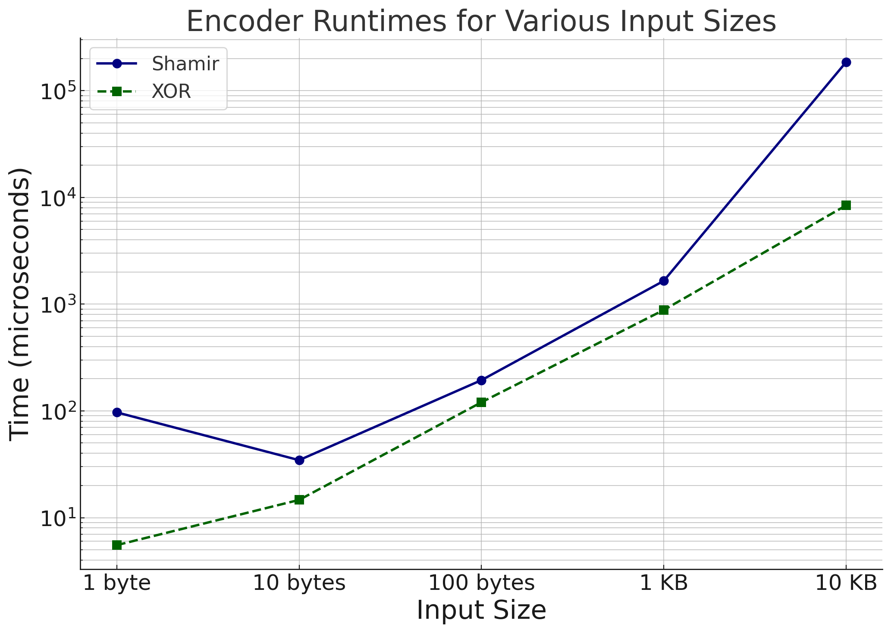
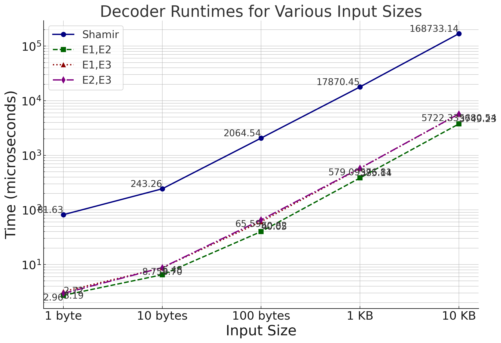

# Secret Sharing Schemes Comparison

This project compares the performance of two secret sharing schemes:

1. **Shamir's Secret Sharing Scheme**: A cryptographic method for dividing a secret into parts, where only a subset of those parts can reconstruct the original secret.
2. **XOR-based Secret Sharing**: A simpler, faster method for splitting a secret into multiple parts using XOR operations.

## Features

- **Encoding**: Both schemes encode a given secret into multiple shares.
- **Decoding**: The shares can be used to reconstruct the original secret.
- **Performance Benchmarking**: The runtime of encoding and decoding operations is measured and compared.

## Benchmarking Results

The following images show the comparison of encoding and decoding runtimes for both secret sharing schemes:

### Encoding and Decoding Runtime Comparison

### Encoding Runtime Comparison for variable INPUTS

### Decoding Runtime Comparison for variable INPUTS

